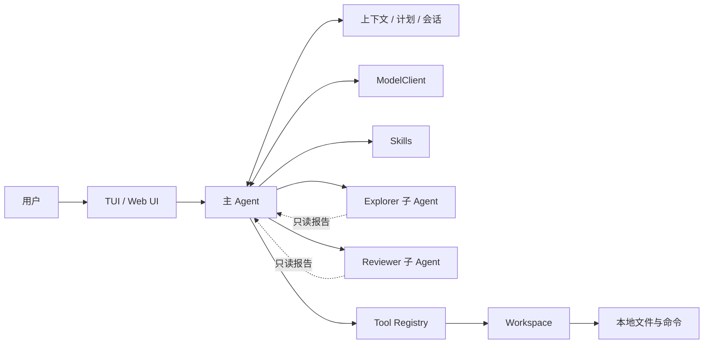

# CAworker

> 一个从零实现、面向本地代码仓库的多轮编程 Agent。

[](https://github.com/STL250/agent/actions/workflows/ci-cd.yml)


CAworker 不依赖 LangChain 等 Agent 框架，而是直接实现模型协议、ReAct 工具循环、
上下文管理、会话持久化、权限控制和本地工具执行。它可以在指定工作区中理解代码、
制定计划、修改文件、运行验证，并通过 TUI 或本地 Web UI 与用户持续协作。

项目对外展示名称为 **CAworker**；为保持已有安装方式兼容，Python 包和 CLI 命令仍使用
`rivet`。

## 核心特性

| 能力 | 设计与实现 |
| --- | --- |
| 原生 Agent 循环 | 直接实现 OpenAI-compatible Chat Completions、SSE 流式响应和 Function Calling；工具结果携带原调用 ID 回传模型 |
| 主 Agent + 子 Agent | 主 Agent 负责决策、修改和验证；`explorer` 与 `reviewer` 在独立上下文中只读探索或审查，并返回结构化报告 |
| 工程闭环 | 文件修改会使旧验证失效；只有修改之后成功执行的验证命令，才能形成“修改—验证—完成”的证据链 |
| 多轮会话 | 会话按项目持久化，可新建、搜索、恢复和继续交互；消息、计划、Diff、验证证据与子 Agent 报告可恢复 |
| 分层上下文压缩 | 自动或手动压缩较早历史，保留近期原文和完整工具调用—结果对；采用结构化摘要与普通关键词检索，不使用 RAG 或向量数据库 |
| 操作级撤销与失败恢复 | 每轮任务形成可撤销检查点；按时间倒序安全撤销，失败任务可恢复检查点后重试 |
| 三层 Skills | 支持内置、用户级和项目级 `SKILL.md`，按需激活正文，项目级同名 Skill 优先 |
| 权限边界 | `safe`、`ask`、`never` 三种模式；路径限制、命令拦截、参数二次校验、原子写入和敏感信息脱敏 |
| 双交互界面 | TUI 提供命令菜单和动态工作状态；Web UI 展示会话、计划、改动、活动、文件、Skills、上下文与子 Agent 状态 |
| 模型兼容层 | Agent 只依赖统一 `ModelClient`，可接入支持 Chat Completions 与 Function Calling 的云端网关或本地服务 |

## 架构概览



主 Agent 的一次任务链路如下：

1. 用户通过 TUI 或 Web UI 输入自然语言任务。
2. Agent 把当前任务、近期上下文、结构化历史摘要和工具定义发送给模型。
3. 模型可以直接回答，也可以制定计划、激活 Skill、委派只读子任务或调用本地工具。
4. 工具参数先经过本地 Schema 与权限校验，再由 `Workspace` 在工作区边界内执行。
5. 工具观察结果追加回消息历史，模型基于最新状态继续下一轮推理。
6. 如果产生文件修改，Agent 要求后续验证证据；任务结束后原子保存会话状态。

更完整的模块职责与安全边界见 [架构文档](docs/ARCHITECTURE.md)。

## 快速开始

### 1. 环境要求

- Python 3.10 或更高版本
- 一个支持 Chat Completions 与 Function Calling 的模型服务
- Windows、Linux 或 macOS 终端

项目没有运行时第三方 Python 依赖。

### 2. 安装

```bash
git clone https://github.com/STL250/agent.git
cd agent
python -m pip install -e .
```

### 3. 配置模型

复制配置模板：

```powershell
Copy-Item .env.example .env
```

Linux 或 macOS：

```bash
cp .env.example .env
```

然后填写本地 `.env`：

```dotenv
RIVET_PROTOCOL=openai_chat
RIVET_BASE_URL=https://provider.example/v1
RIVET_ENDPOINT_PATH=/chat/completions
RIVET_MODEL=your-model-name
RIVET_API_KEY=your-api-key
RIVET_AUTH_STYLE=bearer
```

`.env` 已被 Git 忽略，不要把真实 API Key 写入源码、提交记录或演示材料。

配置优先级为：

```text
命令行参数 > 进程环境变量 > .env > 默认值
```

完整 endpoint、自定义 Header、额外请求字段、无鉴权本地服务及协议回传字段配置，参见
[模型接入说明](docs/PROVIDERS.md)。

### 4. 检查模型能力

```bash
rivet --check-model
```

该命令会实际检查流式文本、函数工具调用以及工具结果回传。普通聊天可用并不代表模型一定
能够稳定驱动 Coding Agent，因此建议首次配置后先运行此检查。

### 5. 启动

在需要操作的项目根目录打开终端：

```bash
# 终端界面
rivet

# 本地 Web 界面
rivet --web
```

也可以显式指定工作区：

```bash
rivet --workspace path/to/project
```

Web 服务只监听 `127.0.0.1`，不会把项目目录公开为远程服务。

## 交互界面

### TUI

终端输入 `/` 会显示可筛选命令菜单，并支持方向键选择与 Tab 补全。

| 命令 | 功能 |
| --- | --- |
| `/help` | 查看命令说明 |
| `/status` | 查看会话、模型、计划、上下文和验证状态 |
| `/plan` | 查看当前任务计划 |
| `/diff [path]` | 查看本次会话产生的文件改动 |
| `/skills` | 查看可用及最近使用的 Skills |
| `/permissions [safe\|ask\|never]` | 查看或切换权限模式 |
| `/sessions` | 列出最近保存的会话 |
| `/resume [id]` | 恢复最近或指定会话 |
| `/new` | 新建干净会话 |
| `/exit` | 保存会话并退出 |

任务执行期间按 `Ctrl+C` 会取消当前模型请求、审批等待或命令，但不会退出整个会话。

### Web UI

Web UI 以会话和聊天为主视图，详情面板集中展示：

- 结构化任务计划与实时步骤状态；
- 文件树、行级 Diff、修改统计与验证结果；
- 工具活动、Skills 激活记录和子 Agent 报告；
- 自动/手动上下文压缩状态与压缩比例；
- 按轮次撤销、任务停止以及失败后的恢复重试；
- `safe`、`ask`、`never` 权限模式切换。

浏览器只接收经过处理的交互事件，模型 API Key 不会被序列化到前端。

## 主 Agent 与只读子 Agent

CAworker 采用“集中写入、分工读取”的协作结构：

| 角色 | 主要职责 | 权限 |
| --- | --- | --- |
| 主 Agent | 理解任务、制定计划、整合报告、修改文件、执行命令和验证结果 | 受当前权限模式约束的完整工具集 |
| Explorer | 搜索目录、定位实现、梳理依赖和关键链路 | 只读 |
| Reviewer | 审阅改动、发现缺陷、评估风险和验证覆盖 | 只读 |

是否委派由主 Agent 在每一轮 ReAct 决策中根据任务复杂度判断，而不是每个任务固定启动。
子 Agent 使用独立上下文，不能写文件、运行命令或继续创建下级 Agent；主 Agent 只接收有界的
结构化报告，从而避免并发写入冲突和上下文污染。两个相互独立的只读任务可以受限并行执行。

## 上下文与会话管理

### 分层上下文

当上下文超过阈值时，`ContextManager` 会把消息组织成语义单元：包含 Function Call 的
Assistant 消息与其 Tool Result 始终作为不可拆分的整体。较早单元被归档并压缩为固定结构：

- Current Goal
- Constraints
- Key Decisions
- Code Changes
- Verification
- Pending Tasks
- Important References

近期消息继续保留原文。摘要不符合结构要求或模型摘要失败时，会退回本地确定性模板生成。
归档原文仍可通过普通关键词相关度检索：完整短语命中具有更高权重，并叠加各关键词出现次数；
该过程不使用 Embedding、向量数据库或 RAG。

### 会话持久化

每轮完成后，会话以版本化 JSON 原子写入当前项目的 `.rivet/sessions`。保存内容包括消息、
计划、上下文归档、子 Agent 报告、文件基线、Diff 和验证证据，但不保存 API Key 和包含本机
工作区路径的系统提示。工作区指纹可以阻止会话被错误恢复到其他项目。

## Skills

Skill 采用渐进式加载：模型启动时只看到名称、描述和来源，明确匹配任务后才读取正文，避免
无关说明长期占用上下文。

| 层级 | 目录 | 适用范围 |
| --- | --- | --- |
| 内置 | Python 包中的 `builtin_skills` | 所有项目 |
| 用户级 | `~/.rivet/skills` | 当前用户的所有项目 |
| 项目级 | `<workspace>/.rivet/skills` | 仅当前项目，可按需提交到 Git |

同名 Skill 按“项目级 > 用户级 > 内置”覆盖。Skill 只能提供工作流程与参考资源，不能绕过
权限审批、突破工作区边界或自动执行附带内容。

## 工具与工程闭环

主 Agent 可以使用以下类型的本地工具：

- 计划：`update_plan`
- 浏览：`list_files`、`read_file`、`search_text`、`search_history`
- 修改：`write_file`、`replace_text`
- 检查：`show_diff`
- 执行：`run_command`
- 委派：`delegate_task`、`delegate_readonly_tasks`
- Skills：`list_skills`、`activate_skill`、`read_skill_resource`

所有参数都会在模型输出解析之后再次进行本地验证。`run_command` 执行前后比较工作区快照，
因此脚本、格式化器或代码生成器间接造成的新增、修改和删除也能进入 Diff 与验证状态。

“验证”不是简单让模型口头确认成功，而是记录真实命令执行结果。例如 Python 项目可运行测试、
编译或静态检查。一次文件修改会使先前成功的验证失效；必须在最新修改之后再次成功执行验证
命令，Agent 才能把任务标记为已验证完成。具体使用哪条命令由 Agent 根据当前项目判断。

## 权限与安全边界

| 模式 | 行为 |
| --- | --- |
| `safe` | 自动执行常规安全操作；安装依赖、网络访问、本地 Git 写操作等敏感动作需要确认 |
| `ask` | 文件修改和命令执行等操作逐项确认 |
| `never` | 只读分析，不允许修改文件或执行命令 |

此外还包括：

- 所有文件路径解析后必须位于当前工作区；
- 文本写入使用临时文件与原子替换；
- 命令有超时、输出上限、危险操作拦截和子进程树终止机制；
- API Key 与自定义敏感 Header 会从诊断信息中脱敏；
- 子进程会移除凭据特征明显的环境变量；
- `.env`、会话状态、缓存和构建产物默认不进入 Git；
- 操作级撤销会检查后续文件变化，不能安全恢复时会明确拒绝，而不是覆盖新内容。

## 项目结构

```text
agent/
├─ .github/workflows/ci-cd.yml   # 持续集成与版本发布
├─ docs/
│  ├─ ARCHITECTURE.md            # 架构、安全边界与实现细节
│  └─ PROVIDERS.md               # 模型服务配置说明
├─ src/rivet/
│  ├─ agent.py                   # 主 ReAct 循环与任务状态
│  ├─ client.py / provider.py    # 模型协议与客户端工厂
│  ├─ context.py                 # 上下文压缩与历史检索
│  ├─ session.py                 # 会话持久化
│  ├─ subagents.py               # Explorer / Reviewer 编排
│  ├─ skills.py                  # 三层 Skills 发现与激活
│  ├─ tools.py                   # 工具注册、Schema 和调度
│  ├─ workspace.py               # 文件、命令、Diff、撤销与安全边界
│  ├─ tui.py                     # 终端交互界面
│  ├─ web.py                     # 本地 Web 服务
│  └─ webui/                     # Web UI 展示层
├─ .env.example                  # 模型配置模板
└─ pyproject.toml                # Python 包配置与 CLI 入口
```

## CI/CD

GitHub Actions 在向 `main` 推送和提交 Pull Request 时自动执行：

- Windows / Linux 跨平台检查；
- Python 3.10 / 3.13 兼容检查；
- Python 源码编译与 CLI 入口检查；
- 上下文压缩、历史检索和恢复回归；
- Web UI JavaScript 语法检查；
- wheel 与源码包构建及资源完整性检查。

发布时先更新 `pyproject.toml` 中的版本，再推送同版本的 `vX.Y.Z` 标签。全部 CI 通过后，
工作流会自动创建 GitHub Release，并上传 wheel 与源码包。CI 不读取 `.env`，也不需要模型
API Key。

## 当前边界

- 当前内置协议客户端面向支持 Chat Completions、SSE 和 Function Calling 的服务；原生不同
  协议需要实现新的 `ModelClient` 适配器。
- Web UI 是本地交互界面，不是面向公网部署的远程控制平台。
- 子 Agent 有意保持只读；所有修改、集成和验证由主 Agent 统一负责。
- 验证门禁能保证存在修改后的成功命令证据，但验证质量仍取决于项目本身可用的测试和检查命令。

## License

本项目使用 [MIT License](LICENSE)。
