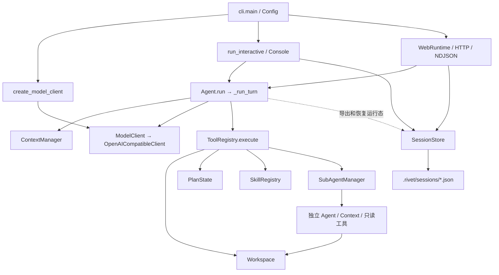

# CAworker Gap Analysis — Phase 0（Tenon 仓库复审）

## 审计范围与结论

本次更新已有 Repository Audit / Architecture Mapping，仅修改本报告，不实施 Phase 1，不修改源码、测试或配置。审计依据是当前仓库实现及用户提供的改造计划；没有把 X-Code CLI / Hello-Agent 的实现视为已经核实的事实，也没有复制其代码。

- 复审日期：2026-09-07。
- 仓库：`D:\github_projects\Tenon`；README 中产品名仍为 CAworker，包名为 `rivet-code-agent`，Python 包和命令仍为 `rivet`。目录迁移不等于已经完成产品改名。
- 当前审计基线：`10b44e7cabfe2ee763f8facd25117bbb5ba44a7f`（`chore: initialize Tenon from CAworker`），版本仍为 `1.9.0`。
- 审计开始时 Git 工作区干净；本次交付只更新本报告。
- 范围覆盖当前目录清单、20 个 Python 模块的结构与关键实现、Web/Core 接口、Skill、项目文档和 CI；未读取真实凭据或本地会话，未调用真实模型。
- 下文“已复现”指无网络、无文件修改的内存模拟或只读调用；“静态确认”指实现直接支持结论；“待验证”指尚未做平台或真实服务实验。存在实现不等于已经通过完整验收。

### 相对上一版的更新

| 项目 | 旧报告 | 本次复审 |
| --- | --- | --- |
| 仓库与历史 | 旧目录 `agent`，提交 `18068e2…` | 当前为 Tenon，Git 仅有初始化提交 `10b44e7…` |
| 历史可比性 | 记录了旧提交与源码哈希 | 当前 Git 不含旧提交对象，无法做可靠的跨版本 Git diff；不能仅凭行数相同断言源码逐字节未变 |
| Runtime 能力 | Registry、Plan、Session、Context、子 Agent 已存在 | 重新检查对应实现，仍可复用；本次未发现足以将 Phase 1 标记为完成的证据 |
| G01/G02 | 工具结果悬空、模型异常与压缩取消逃出 Core | 重新运行旧报告脚本，全部仍可复现 |
| 事件异常 | 主要依据静态分析 | 新增内存复现：首个 `tool_end` 回调抛错后第二个 call 无结果，`last_result=None` |
| Loop/预算/验证/脱敏 | 已有缺口证据 | 重新复现 A/B 循环、耗时干扰签名、单条输入超预算、跟踪不完整仍验证通过、事件流保留合成 secret |
| 本地目录 | 列出空 tests、examples、运行数据和 build | 当前检出中不存在这些目录，目录图已修正；仍无正式 tests 测试集 |
| 下一步 | Phase 1-A 边界建议 | 补充拆分顺序、设计约束、测试矩阵和可直接使用的下一轮任务说明 |

因此，本次主要是**迁移后重新建立可信审计基线，并确认缺口仍在**，不能把旧报告的全部结论直接视为新版本验证结果，也不能据仓库更新推断功能已补齐。本文保留 G01–G10 编号，便于后续修复引用。

**总体结论：CAworker 已经具备一套可演进的 Coding Agent Runtime，不能按“只有最小循环、其余都缺失”来重建。** Tool Registry、参数验证、结构化错误、PlanState、Session / Resume、ContextManager、三层 Skill、只读子 Agent 与线程池都已有实现。主要差距是停止路径的一致性、工具调用协议完整性、长任务预算和持久化边界，以及缺少系统性的行为回归测试。

优先复用 `Agent`、`ToolRegistry`、`Workspace`、`PlanState`、`ContextManager`、`SessionStore`、`SubAgentManager`、`SkillRegistry` 和 `ModelClient`。先修可靠性缺口，再逐阶段补能力；现阶段没有理由先换数据库、换 Agent 框架或重写 Skill 系统。

## Current Architecture

### 1. 目录与模块职责

```text
Tenon/
├── pyproject.toml                Python >= 3.10；无运行时第三方依赖
├── README.md / README.txt
├── docs/
│   ├── ARCHITECTURE.md
│   ├── PROVIDERS.md
│   └── CAWORKER_GAP_ANALYSIS.md   本报告
├── src/rivet/
│   ├── __main__.py / cli.py      CLI 入口、TUI 会话调度
│   ├── agent.py                  主循环、任务证据、运行态与恢复
│   ├── types.py / errors.py      ModelClient、消息/结果与异常类型
│   ├── config.py                 CLI / 环境变量 / dotenv 配置
│   ├── provider.py / client.py   Provider 工厂、HTTP / SSE 协议实现
│   ├── diagnostics.py            真实模型兼容性检查
│   ├── tools.py                  工具定义、注册、校验、审批和执行
│   ├── workspace.py              路径、文件、命令、Diff、快照和撤销
│   ├── plan.py                   显式任务步骤状态
│   ├── context.py                上下文视图、结构化压缩、原文归档检索
│   ├── session.py                按工作区保存/恢复 JSON 会话
│   ├── subagents.py              explore/review 与受限线程池
│   ├── skills.py / prompt.py     Skill 注册和提示词构建
│   ├── builtin_skills/           bug-diagnosis、python-testing 及参考资料
│   ├── tui.py                    终端输入、事件显示与审批
│   └── web.py / webui/           本地 HTTP 服务、HTML/CSS/原生 JavaScript
└── .github/workflows/ci-cd.yml   编译、资源/打包检查与上下文 smoke
```

当前检出没有 `tests/`、`examples/`、`build/` 或 `.rivet/`；后者是运行时可创建的数据目录。未找到适用于本仓库的 `AGENTS.md`。CI 中已有内嵌的上下文 smoke 脚本，因此“无正式测试目录”不等于“完全没有验证”。

`pyproject.toml` 将命令映射为 `rivet.cli:main`。模块规模提示后续拆分边界：`agent.py` 1,231 行、`workspace.py` 1,427 行、`tools.py` 621 行、`web.py` 809 行、`tui.py` 951 行、`webui/app.js` 2,105 行。行数本身不是缺陷；主要问题是生命周期和业务规则分布在不同层。

### 2. 实际依赖与运行链路



主 Agent 每个用户 turn 的现有生命周期：

1. `Agent.run()` 加运行锁、重置取消状态、初始化 Skill/子 Agent 本轮状态；完整工具作用域下建立工作区轮次快照。
2. `_run_turn()` 追加用户输入，默认最多执行 30 个模型 step；每步先尝试压缩上下文，再调用模型。
3. 模型响应被转换为 assistant 消息；多个 tool call 在主 Agent 内按顺序执行。
4. `ToolRegistry.execute()` 查工具、解析 JSON、校验 schema、判断审批，再调用 handler；结果返回 JSON 字符串。
5. `TaskState.record_tool_result()` 收集读文件、改文件和命令证据；结果通过原 `tool_call_id` 追加给模型，并发出 UI 事件。
6. 检查重复观察；无工具调用的最终文本还要经过计划完成和修改后验证门槛。
7. `_finish()` 设置 `AgentResult` 与总步数；`run()` 的 `finally` 结束工作区快照并解除运行锁。
8. TUI/Web 调度层调用 `SessionStore.save()`。**保存由界面调度层触发，Core 自身并不保证所有异常都会得到结果并落盘。**

入口证据：`cli.py:67,115`；主循环 `agent.py:533,594`；执行边界 `tools.py:93`；Web 调度 `web.py:94,186`。

### 3. 十二项审计入口映射

| 检查项 | 实际位置 | 判断 |
| --- | --- | --- |
| 目录与启动 | `pyproject.toml`、`__main__.py`、`cli.py:67` | 单 Python 包，TUI/Web 双入口 |
| Agent 主循环 | `agent.py:533,594,886` | 主/子 Agent 复用同一个循环 |
| LLM 调用层 | `types.py:28`、`provider.py:9`、`client.py:42,84` | 已有接口与协议客户端，非 DeepSeek 硬编码 |
| Tool 定义/注册/执行 | `tools.py:22,40,93,251` | 统一注册表，内置工具集中构造 |
| Main/Sub-Agent | `agent.py:1030`、`subagents.py:48,216` | 主 Agent 串行修改；子 Agent 只读 |
| Context/Message | `context.py:37,138,150`、`agent.py:1212` | 活跃消息、摘要、归档原文及 UI transcript |
| Skill | `skills.py:39,67,128,161`、`prompt.py:6` | 三层发现、元数据目录、按需激活 |
| Permission | `tools.py:74,116`、`workspace.py:374,766,776` | scope + mutating + mode + 命令规则，尚无统一策略对象 |
| 错误/重试/轮次 | `tools.py:93`、`client.py:42,84,173`、`agent.py:594` | 工具错误可自纠正，模型错误和取消边界不一致 |
| Web/Core 耦合 | `web.py:30,94,231,399`、`webui/app.js:1204,1323` | Core 不依赖 Web；Web 直接访问运行态和 Workspace |
| Session/Conversation | `session.py:45,54,94,436`、`agent.py:442,462` | 已有持久化和跨重启恢复，轮次结束保存 |
| 不完整功能 | 本文后续缺口与验证表 | 重点是可靠性、权限统一和测试证据 |

### 4. 工具与权限的真实边界

主 Agent 在正常 CLI/Web 配置下可获得以下工具：

| 类别 | 现有工具 | 说明 |
| --- | --- | --- |
| 读取/搜索 | `list_files`、`read_file`、`search_text`、`search_history` | `search_text` 支持 literal query 和 file glob；不是独立 grep/glob 工具 |
| 修改/命令 | `write_file`、`replace_text`、`run_command` | `mutating=True`；普通读工具与这些工具审批不同 |
| 差异 | `show_diff` | 比较本会话最初内容；不是任意 Git revision diff |
| 任务状态 | `update_plan` | 更新整份计划，属于会话状态修改 |
| 子任务 | `delegate_task`、`delegate_readonly_tasks` | 后者要求提供 client factory，正常 CLI/Web 已提供 |
| Skill | `list_skills`、`activate_skill`、`read_skill_resource` | 返回文本和资源，不执行 Skill 脚本 |

`ToolSpec` 已包含 name、description、parameters、handler、mutating。`parameters` 对应输入 schema，`handler` 对应执行入口；缺的是更明确的权限元数据和可扩展注册接口，不能称为“没有 Tool System”。本地校验支持当前内置 schema 使用的对象、数组、字符串、整数、布尔、枚举和范围，是 JSON Schema 子集，不是完整规范实现。

当前权限行为：

| 作用域/模式 | 实际效果 |
| --- | --- |
| full + safe | 普通文件修改和未命中规则的命令自动执行；部分网络、安装、Git 操作请求确认 |
| full + ask | 所有 mutating 工具请求确认，包括全部 shell 命令 |
| full + never | 禁止 mutating 工具；仍可更新计划、激活 Skill 或委派只读任务 |
| read_only | 只注册计划、列表、读取、搜索、历史搜索、Diff；修改及 shell 工具根本不暴露 |
| Workspace 命令阻断 | 命中 `RISKY_COMMANDS` 的命令即使获得审批也会被拒绝；例如现有 `git push` 是阻断，不是 ASK |

Explore 和 Review 使用相同只读白名单，只在提示词职责上区分。二者都不能运行测试命令；这比用户计划中允许某些 test 操作的权限表更严格，可保留，未来通过明确的测试证据输入满足 Review 需求。

### 5. Session、Context 与 UI 的数据关系

- Session 使用 `.rivet/sessions/*.json`，含 schema version、会话 ID、工作区路径指纹、时间、model、metadata、Agent 状态及最后结果；以临时文件加 `os.replace()` 保存，单文件上限 64,000,000 字节。
- Agent 导出 tasks、turns、total_steps、conversation、context_state、transcript、plan/task/workspace/subagent/skill state。API key 和 endpoint 配置不在这个导出结构中，但工具结果可能携带敏感文本，不能据此保证会话内容无秘密。
- `conversation` 是当前 Context View 去掉初始 system prompt 后的内容；较早原文在 `context_state.archived_units` 中。完整原文并未因压缩直接丢弃，但不是一个独立、带全局顺序 ID 的 append-only conversation log。
- 压缩保留近期默认 8 个消息单元及最新 user 单元；assistant tool calls 和紧随其后的对应 tool 消息组成不可分割单元。生成固定七节摘要，模型摘要失败时有确定性 fallback。
- `/resume [id]` 可恢复上下文、计划、执行证据、Diff 基线、子 Agent 报告和 Skill 使用历史；已跟踪文件发生外部变化时使旧验证失效。不会恢复进程、线程、进行中的命令或精确执行到一半的 step。
- Web 是本地 `ThreadingHTTPServer`，与模型 SSE 不同，浏览器接收的是 NDJSON；一个 WebRuntime 只有一个活动 Agent、一个 turn 锁和一个流 writer。
- Web 直接读取 `agent.tools.workspace`、`agent.transcript`，负责保存、审批等待、失败转结果以及构造中文 retry/continue 输入。前端硬编码工具名、事件名与结果字段；会话搜索仅过滤已经加载的最多 100 个会话标题和任务预览。
- 断开浏览器连接后 `_write_record()` 仅移除 writer，后台任务通常继续运行。没有事件序号、订阅恢复或重放机制；这是长任务 UX 的缺口，不等于已有会话文件不能恢复。

## Existing Features

以下代码应保留并通过回归测试保护：

1. **统一循环与模型边界**：`Agent` 依赖 `ModelClient.complete()`，可选探测 streaming/cancel 方法。`OpenAICompatibleClient` 实现 Chat Completions、SSE 分片累积、tool call 解析、reasoning 等 replay 字段保留，以及流式不兼容时的非流式回退。
2. **参数校验与工具自纠正**：执行前拒绝未知字段、缺字段、类型/范围错误；返回 `{ok:false,error,code,retryable,field?}`。模拟错误参数后正常回答已通过。
3. **基础可靠性防护**：最大步数、两次空回复停止、三次连续相同 call-result 停止；HTTP 暂时性失败默认初次请求加最多 3 次重试，1/2/4 秒退避。
4. **修改与验证证据**：写文件使旧验证失效；命令前后快照识别间接修改；同一条既修改又验证的命令不能验证自身修改。未验证就结束会先纠正、再停止。
5. **Plan/Todo 基础**：有显式 PlanState、最多 20 步、最多一个 in_progress、去重、revision、持久化，以及未完成计划阻止结束。已超出仅在提示词中“写计划”。
6. **会话与工作区恢复**：新建、列出、加载、恢复、删除，以及 Web 重命名、置顶、Markdown 导出；Diff、轮次撤销和失败重试已有实现。
7. **上下文分层**：自动/手动压缩、固定结构摘要、近期原文、归档搜索、恢复归档。现有 CI 的压缩/检索/恢复 smoke 在本次本地执行通过。
8. **子 Agent 基础完整**：复用 Agent，独立上下文、任务文本、较小步数上限、只读工具、禁止递归委派、共享取消、结果报告；正常 CLI/Web 并发任务使用独立模型客户端。
9. **三层 Skill**：内置 → 用户 `~/.rivet/skills` → 项目 `.rivet/skills`，后层覆盖同名项；name/description 进入目录，正文经 activate 作为工具结果注入上下文；资源白名单、大小与符号链接检查已存在。
10. **文件与命令工程能力**：工作区路径校验、原子文本写入、精确替换、Diff、快照预算、撤销前漂移检查、撤销失败回滚；命令超时/取消及进程树终止已有 Windows/POSIX 实现。

## Partially Implemented Features

### G01 — 重复检测停止时会留下未完成的工具调用（高，已复现）

证据：`agent.py:677` 开始批量执行，`:729` 第三次相同观察后直接返回；相比之下，取消分支 `:703` 会补齐 pending calls 的取消结果。

一个 assistant 消息返回 4 个相同只读调用时，前 3 个执行后触发停止，第 4 个 ID 已在 assistant 消息中声明，却没有 tool 结果。`ContextManager.restore()` 的消息校验也接受了这个历史。继续或恢复会把不完整工具协议带到下一次模型请求，严格校验的服务可能拒绝。

**建议：** 所有提前退出统一结清已声明的 call ID；未执行的调用以明确 skipped/stopped observation 收尾。随后增加会话恢复及发送前的调用配对检查。复用取消分支现有逻辑，不另写一套循环。

### G02 — 异常与取消没有覆盖完整 step 生命周期（高，已复现/静态确认）

- `agent.py:646` 的模型调用只捕获 KeyboardInterrupt / OperationCancelled，ModelError 向上抛。直接调用 Core 时 `last_result=None`；本次第一步失败模拟中 `total_steps=0`。
- `cli.py:212` 在 `agent.run()` 成功返回后才保存。ModelError 进入 `main()` 外层错误处理并退出，失败轮次不会走正常保存。
- `web.py:156` 则调用 `record_failure()` 后保存，同一失败在两种界面中行为不同。
- `agent.py:636` 的 `context.compact()` 位于上述取消处理之外。模拟 summarizer 抛 OperationCancelled 时，异常逃出 `run()`，没有规范 cancelled result。
- 事件回调及审批回调也不都位于工具 handler 的保护边界内。本次新增复现：同一响应含 `a/b` 两个 read_file 调用，首个 `tool_end` 回调抛 RuntimeError 后异常逃出 Core，`b` 没有 observation，`last_result=None`。审批及其他回调组合仍未逐一模拟。

**建议：** 将压缩、模型、工具、observation 和收尾纳入一致的 turn/step 错误边界；所有受控停止都形成 AgentResult，准确保留实际完成步数，TUI/Web 共享失败语义。UI 事件失败不应破坏工具协议和任务状态。

### G03 — Loop Guard 只覆盖一种连续重复（高，已复现）

证据：`agent.py:719,1202`。签名绑定工具名、规范化参数和整个结果 JSON，只与紧前一次工具观察比较。

- A/B/A/B 交替重复不会触发 guard，模拟只在 max_steps 停止。
- 命令结果中的 `duration_ms` 发生变化，签名就变化；其余参数/错误完全相同也不会被认为重复。
- 没有独立的相同调用计数、相同错误计数、滑动窗口循环识别或无进展检测。
- `max_steps` 限制模型循环次数，不限制单次回复的工具数量、总工具调用数、摘要请求数或整个 turn 的墙钟时间。

**建议：** 独立 Guard 状态，忽略不影响语义的耗时字段，分别统计调用/观察与进展。相同读取但文件实际变化应允许；A/B 循环与新信息读取应区分。阈值和 warning/stop 行为需明确，不能仅以“没写文件”判断无进展。

### G04 — 验证与错误 observation 的语义仍依赖调用方理解（高/中，部分已复现）

证据：`workspace.py:801,845`、`tools.py:143`、`agent.py:81,147`。

- shell 非零退出或超时通过正常 handler 返回，外层仍标记 `ok:true`，实际失败由 exit_code/timed_out 表达。这不是命令被误当成功执行验证，但错误协议不统一，调用方要知道工具特例。
- 错误通常仅区分 INVALID_ARGUMENT / TOOL_ERROR / INTERNAL_ERROR / APPROVAL_REQUIRED 等；没有明确 file-not-found、timeout、permission-denied 类型，错误结果本身不携带工具名和参数。调用消息能关联参数，但日志独立消费较困难。
- `TypeError` 一律归为参数错误，即使来自 handler 内部；WorkspaceViolation 与其他 ToolError 的 retryable 多为 true，策略拒绝与可纠正错误没有细分。
- `purpose='verify'` 可以由模型声明，普通命令只要成功且在修改之后就能构成验证证据；auto 分类也是命令字符串正则，不能证明测试真的检查了修改。
- 已复现 `workspace_tracking_complete=False` 仍可得到 `verification_passed=True`。目前它是单独提示标志，没有纳入完整性判定；需要明确“不完整跟踪下验证成功”的结果语义。

**建议：** 保留现有结果兼容字段，补统一 ToolOutcome/Error 类型和证据等级。修改后成功运行检查的时间关系可复用；还需区分 syntax、test、lint、自定义验证和 tracking limited，避免把 `completed_verified` 解释为充分正确性证明。

### G05 — 有只读基础，但没有真正的 Plan Mode（中，静态确认）

证据：`cli.py:176` 的 `/plan` 只展示当前 PlanState；`tools.py:74,116` 的 scope/mode 控制工具。

缺少 Plan → 用户批准具体计划版本 → Execute 的状态转换，缺少稳定 Todo ID / FAILED 状态及单任务更新接口。当前状态是 pending / in_progress / completed / blocked，不能简单说没有 Todo；blocked 与 failed 也不能直接混同。

**建议：** 在 PlanState 上渐进扩展 ID、状态迁移和版本审批；只读限制、Main/Explore/Review 角色最终统一进入 PolicyEngine。`never` 是 mutation 禁用模式，不应直接当作完整 Plan Mode。

### G06 — Session 可恢复，但长任务崩溃恢复尚不完整（中，静态确认）

证据：`session.py:54,436`；`cli.py:212`；`web.py:186`；`agent.py:442,462`。

已有正常结束、受控停止、Web 失败后的保存。缺少执行中的持久化 checkpoint、pending tool 状态、幂等执行/重放策略；进程异常退出时，本轮新上下文、Todo 进度与撤销基线可能尚未落盘。原子替换防止半份 JSON，但不等于执行事务，也没有显式 fsync 或多进程写入协调。

其他边界：restore 消息仅做浅层角色检查；列表逐个读取完整会话且最多返回 100 项；64 MB 上限、归档原文和多份快照会制约超长会话；工作区路径指纹限制搬迁恢复；漂移检测针对已跟踪文件，并非整个项目快照。

**建议：** 保留 JSON 第一版，先补恢复协议和一致保存责任。只有经过容量/并发需求验证后再考虑 SQLite；已有 JSON 会话须有明确兼容策略。不要自动重放结果未知的 shell 或写操作。

### G07 — 压缩保留原文，但预算和任务状态注入不足（中，已复现/静态确认）

证据：`context.py:150,218,325,547`、`agent.py:901`。

- 按消息 JSON 字符数触发，不是 token 预算，且不计本次 tools schema、输出预留等请求开销。
- 即使超过阈值，只要近期单元不能丢弃，就返回 not_enough_history；压缩后只要求比原来小，不要求低于 max_chars。已复现 5,000 字符用户输入在 1,000 字符预算下仍保留超限上下文。
- PlanState / TaskState 是程序状态，但未每次作为权威 Context 层注入。较早工具计划进入摘要后，LLM 主要依赖摘要而非当前程序快照。
- 自动摘要调用使用同一个模型客户端，输入直接包含待压缩消息；没有独立摘要请求预算，也不计入主 max_steps。
- latest user 也可能是系统为验证/计划生成的纠正输入；后续 Current Goal 需要与真实用户目标分离。
- fallback 分节截断优先保留已有条目，新决策有被旧条目占满预算的风险；当前有保底机制，但摘要语义质量未系统评测。

**建议：** 将原始历史、当前程序状态与发送给模型的 Context View 明确区分；逐步加入预算计算、超限降级和权威 Goal/Plan/Verification 注入。保留归档原文，不能以迁移为由删除历史。

### G08 — 子 Agent 隔离已有，任务 deadline 与报告边界不足（中，静态确认）

证据：`subagents.py:85,119,128,216,298`；`agent.py:1030`；`config.py:225`。

- 每个子 Agent 有独立 Agent/Context/Plan/TaskState，只有任务文本和模式提示词，不继承完整主对话；共享 Workspace 用于读取和 Diff 基线。隔离是工具能力约束，不是独立进程/文件系统沙箱。
- 默认 12 steps、每轮最多 2 个子任务、线程池最多 2 并发。配置虽允许更大数值，Manager 会再次 clamp 到 2；这些限制应文档化。
- HTTP 有 request_timeout，但没有子任务整体 deadline；`as_completed()` 和 `future.result()` 没有 timeout，线程池退出还会等待线程结束。单请求超时不等于子任务总时限。
- 一般 child 异常会变成 failure report，因此已有 partial failure 基础。开始/结束事件等保护范围外的异常仍可能使 future 抛出并中断聚合；取消是共享协作式取消，不能只靠 future.cancel 停止已运行线程。
- `SubAgentReport` 有 task/status/summary/reason/evidence/risks，但 summary 直接使用 result.final，未硬性限制长度；evidence 目前仅 inspected_files，不是结构化 findings、测试证据或完整 errors。
- 子 Agent trajectory 不回灌主上下文，这一点已经符合目标。Review 的文件/测试证据输入没有独立协议，目前只能靠任务文本及可读文件提供。

**建议：** 保留线程池和现有 Agent；补整体 deadline、取消后的收尾和稳定聚合，单个失败不吞掉其他报告；对报告设置预算并增加 findings/files/errors 等结构化字段，保留旧字段兼容 UI 和 Session。

### G09 — Skill 需要补生命周期管理，不需要重写（低，静态确认）

证据：`skills.py:57,63,67,128,230`。

| 能力 | 当前情况 | 建议 |
| --- | --- | --- |
| builtin/user/project | 已具备，项目同名覆盖 | 保留层级与注册表 |
| load/discover | 启动与 reset 时 refresh，校验有大小/路径边界 | 补可见刷新与缓存失效约定 |
| activate/context 注入 | 已具备，description 支持模型自主选择 | 保留按需披露 |
| create | 没有专用创建接口/命令；用户可手工建 SKILL.md | 后续按需要补管理入口 |
| enable/disable | 没有持久化开关、来源允许列表或同名覆盖选择 | 后置小幅扩展 |
| 生命周期 | 每 turn 清 active，保存使用历史，restore 不恢复 active | 明确“本轮激活”与“历史正文仍在 context”区别 |
| 项目权限 | 资源读取有边界，不能直接授予新工具权限 | 项目文本可信度仍依赖提示词与统一工具权限；后续接 PolicyEngine |

不应宣称“disable 已实现”，也不应把“项目 Skill 是普通文本”误当成已经具有独立执行沙箱。

### G10 — 脱敏与资源边界覆盖不一致（高/中，部分已复现）

证据：`web.py:399,450`、`client.py:446`、`workspace.py:392,459,509,776`。

- Web 的 snapshot/部分预览会做配置 API key 替换，但 `_write_record()` 原样序列化事件和最终结果。本次用完全虚构的 secret 和 BytesIO 已复现事件流保留该字符串；没有使用真实密钥。若工具观察或模型文本含密钥，流通道不享有相同保护。
- `read_file()` 没有应用 Web preview 的敏感路径过滤，Session 保存也未统一脱敏。UI 预览屏蔽 `.env` 不代表模型工具或持久化层同样屏蔽。
- `read_file()` 先读完整文件再截断输出；search 在读入后才检查 2 MB；subprocess.communicate 收集完输出后才截断。因此有展示/返回长度限制，但没有完整的内存使用上限。
- `search_text()` 只 resolve 初始搜索路径，对 rglob 得到的文件直接 read_bytes，没有对每个候选再次进行 workspace containment 检查。符号链接文件可能引入越界读取风险；本次未创建链接或访问工作区外数据，此项待平台复现。
- shell 使用 `shell=True` 与正则规则，cwd 限定不构成 OS 沙箱。read-only scope 禁止 shell 是有效现有约束；safe 模式对任意脚本/命令的完整语义分类则没有保证。

**建议：** 优先统一事件/结果/持久化的脱敏边界并添加合成秘密测试；Policy 阶段统一资源校验，补链接边界测试；长输出用有界读取/缓冲。保留原文要求与脱敏要求需定义清楚：保留可恢复的必要历史，不默认长期保存凭据。

## Missing Features

以下指缺少相应的明确机制，不否定已有基础：

- 单独的、覆盖整个 step 的执行生命周期与可复用停止/收尾协议。
- 独立 No Progress 检测、循环窗口检测、总工具数和 turn deadline。
- Plan Mode 的只读分析 → 审批具体计划 → Execute 转换，以及统一 ALLOW / ASK / DENY PolicyEngine。
- 稳定 Todo ID、失败状态及可验证的状态迁移约束。
- 执行中 durable checkpoint、pending tool 恢复策略、事件重放。
- 包含工具 schema/响应预留的 Context 预算，以及压缩后仍超限的明确处理。
- 子 Agent 整体时限、硬性有界报告和完整的 partial failure/cancellation 验收。
- 独立跨会话 Memory Store。现有 search_history 仅检索当前会话归档，不是跨会话记忆或向量检索。
- MCP client/server、Plugin runtime / Marketplace；仓库未发现对应实现，按计划后置。
- 系统性行为测试和 Coding Task Benchmark。模型兼容检查只证明协议链路基本可用，不等于复杂任务完成能力评估。

### 能力对照表

优先级“高/中/低”表示缺口重要性；执行阶段仍严格遵守用户要求的 Phase 1 → 7 顺序。涉及现有路径正确性的修复可先在 Phase 1 补，不表示提前建设后续模块。

| 能力 | CAworker 当前情况 | 是否需要重构 | 优先级 |
| --- | --- | --- | --- |
| Agent Loop | 单循环、串行工具、完成门槛；异常/停止配对有缺口 | 小范围整理生命周期，保留 Agent | 高 / Phase 1 |
| Tool System | ToolSpec + Registry + schema 校验 + handler | 补 outcome/权限元数据与注册边界，不重建 | 高 / Phase 1 |
| Error Recovery | 工具可自纠正、HTTP 重试、Web retry；TUI 失败路径不一致 | 统一 Core/界面错误与取消结果 | 高 / Phase 1 |
| Loop Guard | 连续相同 call-result 三次 + max_steps | 独立检测状态，补窗口/进展/预算 | 高 / Phase 1 |
| Plan Mode | 有 never/read_only；/plan 仅展示 | 新增模式转换，复用权限基础 | 中 / Phase 2 |
| Todo | PlanState 与 update_plan 已实现 | 渐进增加稳定 ID/状态迁移，兼容现有状态 | 中 / Phase 2 |
| Session | 版本化原子 JSON，状态覆盖较完整 | 保留存储，补执行中检查点与容量边界 | 中 / Phase 3 |
| Resume | TUI/Web 都可恢复，多类状态与漂移处理 | 补协议验证与进行中任务恢复语义 | 中 / Phase 3；配对缺陷先修 |
| Context Compression | 结构化摘要、近期原文、归档/检索/恢复 | 补预算、权威状态注入与超限处理 | 中 / Phase 4；取消缺陷先修 |
| Sub-Agent | 独立上下文、只读、结构化报告、线程池 | 保留设计，补 deadline/报告边界/聚合 | 中 / Phase 5 |
| Permission | safe/ask/never、scope、命令/路径规则 | 汇聚为 PolicyEngine，保持旧模式兼容 | 高 / Phase 2 |
| Skill | 三层发现、激活、资源读取、使用记录 | 仅 Audit 后局部补生命周期管理 | 低 / Phase 7 |
| Memory | 当前会话归档检索；无跨会话存储 | 暂不实现独立 Memory | 低 / Phase 7 |
| MCP | 未发现 | 当前不实现 | 低 / Phase 7 以后评估 |
| Plugin | 未发现运行时/Marketplace | 当前不实现 | 低 / Phase 7 以后评估 |

## Technical Debt

1. **Core 与适配层边界不完整。** Agent 不依赖 Web，是良好基础；但 Web 独有失败保存与恢复输入构造，TUI 单独处理 session，容易产生行为差异。建议共用 turn 协调逻辑和结果协议，不先更换 Web 框架。
2. **Agent 仍知道具体工具语义。** TaskState 按 read_file/write_file/run_command 名称解释结果；`Agent._build_runtime()` 组装具体 callbacks，Agent/UI 访问 `tools.workspace`。Registry 已隔离执行，但没有完全隔离证据与权限语义。
3. **工具结果、事件、状态大多为 dict/字符串。** UI、Context fallback、TaskState 各自解析同一结果。新增工具若遗漏一处映射，就可能执行成功但没有证据/显示。后续应增加少量有类型的共享协议，而非一次替换所有字典。
4. **Provider 基础已抽象，能力契约尚小。** ModelClient 只声明 complete；stream/cancel/reset_cancel 用 getattr，finish_reason/usage 没有统一暴露。当前支持一种 openai_chat 协议足以承载兼容服务；是否支持具体 DeepSeek 模型应另做真实兼容测试，本次不调用 API。
5. **输出限制与内存限制混淆。** 文档中的 bounded output 主要是返回结果截断；不能推导运行时内存也受限。全工作区命令前后哈希与轮次快照有可见性能成本，未做大仓库 benchmark。
6. **持久化不是单一事实日志。** conversation view、archive、transcript、task evidence、last_result 存在交叉信息；序列化/恢复变更需要版本与兼容测试。接口尚未体现 running/pending/finished 工具事务。
7. **只读与所有用户操作不是同一权限边界。** Web 的 undo/revert 是明确用户触发的管理操作，直接调用 Workspace，没有走 ToolRegistry。不能把这个设计直接标为模型权限绕过，但未来 Plan Mode 必须明确是否也约束这些 UI 操作。
8. **文档存在超出实现的表述。** ARCHITECTURE 的子报告描述含 command/changed/verification 等证据，实际 report evidence 只有 inspected_files；“不会向浏览器序列化凭据”没有覆盖原始事件流。Provider 文档仍称 Version 1.5，client User-Agent 为 1.7，而包版本为 1.9.0。需在对应实现修复后同步文档。
9. **回归测试是最大交付证据缺口。** 当前没有 tests 目录或正式行为测试集。CI 已有源码编译、CLI help、资源、JS syntax、打包检查和 context smoke，不能据此声称“没有任何测试”，也不能据此声称 loop/permission/session/concurrency 已验证。
10. **仓库迁移后的标识尚未同步。** README 的 clone、徽章链接仍指向 `STL250/agent`，目录示例也仍称 agent。是否改名为 Tenon 应由产品目标决定；当前无需为修可靠性而批量改包名或 `.rivet` 数据目录。Session 的工作区路径指纹意味着旧目录的会话不能默认直接搬到新目录恢复，后续迁移须单独设计，不能直接移除校验。

## Recommended Refactoring Order

继续采用用户给定的阶段顺序；每个开发任务先确认小范围设计，再编码。以下是建议拆分，不是本次已经实施的设计或修改。

| 阶段 | 复用基础与建议工作 | 阶段验收重点 |
| --- | --- | --- |
| Phase 0 | 更新本报告、架构映射、复现证据与能力对照 | 仅更新报告；源码不变 |
| Phase 1 | 先修 G01/G02，再统一 ToolOutcome、Guard、完成证据；对现有输出补脱敏回归 | 所有受控停止无悬空调用；TUI/Web/Core 失败一致；可自纠正；识别重复与无进展；验证结果语义准确 |
| Phase 2 | 在 PlanState 上扩展 Todo；将 scope/mutating/mode/operation/resource 汇聚为 PolicyEngine；建立 Plan→审批→Execute | 普通/失败/边界权限矩阵；读模式任何模型路径均不能写；计划批准有版本关联 |
| Phase 3 | 保留 SessionStore JSON，补 checkpoint、running/pending 状态与恢复策略 | 重启恢复 conversation/plan/evidence；损坏会话可诊断；结果未知的写操作不自动重放；兼容旧会话 |
| Phase 4 | 保留 ContextManager/归档搜索，补 Context View 和请求预算 | 超限有确定行为；工具对不拆分；权威 Goal/Plan/验证状态保留；原始历史仍可恢复 |
| Phase 5 | 保留现有子 Agent 和 ThreadPoolExecutor，补整体 deadline、有界报告和聚合 | 只读约束、两任务成功/一失败/超时/取消、收尾释放资源；主上下文不接收完整子轨迹 |
| Phase 6 | 建立固定任务集、离线 fake-client 回归与单独真实模型评估 | 区分任务成功、测试通过、违规修改、恢复率、调用量与耗时；结果可复现 |
| Phase 7 | Skill 缺口小补；按实际需求评估 Memory/MCP/Plugin | 不影响 Runtime 既有契约；每个扩展有独立必要性与验收 |

**测试不能等到 Phase 6 才开始。** Phase 1 起每个模块都补 normal/failure/boundary 回归；Phase 6 才做系统 Benchmark 和多任务评估，二者不是同一件事。

### 下一项建议任务：仅确认 Phase 1-A 设计

- **Goal：** 所有已声明 tool call 都有结算结果，模型错误和压缩取消得到统一失败/取消结果。
- **Current Problem：** G01/G02 已有确定复现，直接影响后续 Resume 与长任务。
- **Proposed Architecture：** 在现有 Agent 内集中提前停止/补齐未执行工具的逻辑，建立覆盖压缩至收尾的异常边界；共享 turn 失败语义，Session 保存仍保持现有格式。
- **Files to Modify（拟议）：** 首先聚焦 `agent.py`、`cli.py`、`web.py`；按实际配对验证放置再评估 `context.py`，新增必要行为测试。无需同时修改 Skill、数据库或子 Agent 架构。
- **New Interfaces（待确认）：** 一个集中结算 pending calls 的内部方法；必要时一个共用 turn 结果协调入口。首个补丁不要求引入全新的 AgentRuntime 类。
- **Compatibility Risks：** reason 字符串、事件顺序、工具错误 JSON、AgentResult、现有 session 消息与 UI 显示均有调用方；应保持兼容或明确迁移。
- **验收：** 4 个同批调用在第 3 个触发 guard 后仍有 4 个 observation；正常调用数和顺序不变；取消、ModelError、恢复后继续均满足协议；失败任务仍能保存并继续。

这里仅提出下一步边界，**本次没有开始 Phase 1-A 编码**。

### Phase 1 的具体拆分与首项设计约束

| 顺序 | 任务 | 最小交付 | 完成条件 |
| --- | --- | --- | --- |
| 1-A | G01/G02：工具协议和 turn 收尾 | 在现有 Agent 内集中结算；统一受控失败/取消；TUI/Web 保存行为对齐；离线回归 | 下表中的正常、失败、边界场景通过，已有 context smoke 不回退 |
| 1-B | G04：ToolOutcome 与错误分类 | 复用 ToolSpec/Registry，明确 schema 错误、执行失败、拒绝、超时、取消及执行状态 | 失败 observation 可自纠正；不会把 shell 失败当工具业务成功；旧字段调用方有兼容处理 |
| 1-C | G03：Loop Guard 与预算 | 分离调用、观察和进展信号；过滤耗时字段；增加窗口检测及调用数/时间预算 | 重复错误及 A/B 循环可停；有新信息的读取不误停；所有停止复用 1-A 的结算 |
| 1-D | Phase 1 回归收口 | 明确验证证据等级；对已有 Web 输出脱敏补修复与回归 | tracking limited 有明确语义；合成 secret 不经应脱敏的输出通道泄露；无跨层结果不一致 |

1-A 可以拆成“先工具批次结算，后统一异常收尾”两个小提交，每个提交单独验证。1-B 修改结果协议时必须同步 TaskState、Context fallback、TUI/Web 的现有解析；不必为此先重写全部工具。

**1-A 的设计必须先确定以下不变量：**

1. 每个已接受的 assistant tool-call 批次，在继续模型请求或保存可恢复状态前，每个 call ID 恰好有一个对应结果。模型返回重复 ID、孤立 tool result 等非法协议必须有明确拒绝路径。
2. 结算不等于执行：guard/取消之后的未执行调用只补 `skipped` 观察，不能真的执行剩余写操作，也不能把未执行调用计作读文件、修改或验证证据。
3. 工具已经成功执行但事件显示失败时，保留真实结果；不能为修补历史再次运行该工具。执行是否发生无法确认时标记为结果未知，并阻止自动重放副作用。
4. 压缩、模型、工具、审批和收尾中的受控失败形成一次终态结果；`last_result`、steps/total_steps 口径明确且不重复累加，运行锁得到释放。并发重复调用 `run()` 等调用方误用不应被吞成普通成功结果。
5. UI 事件失败与工具失败要分开记录；停止、失败、保存和后续继续在 Core/TUI/Web 中语义一致。原有 `reason`、事件及会话格式优先兼容。
6. 旧会话若已含不完整调用，恢复时明确拒绝或按可解释策略修复；不能凭空声称未知写操作成功，也不能把非法历史继续发给模型。具体策略在编码前选定。

**拟议文件与接口：** 首先调整 `src/rivet/agent.py` 中批次结算和失败边界，`cli.py` / `web.py` 对齐保存与展示；必要时在 `context.py` 放置可复用的消息协议校验。内部可采用 `settle_pending_calls` / `validate_tool_exchange` 一类小方法，名称和返回结构在设计时确定。新增 `tests/` 中的 fake-client 行为测试，并在 `.github/workflows/ci-cd.yml` 接入；Session JSON 不因本补丁默认升级或换库。

| 类型 | 1-A 验收场景 | 期望 |
| --- | --- | --- |
| 正常 | 多工具响应后给最终回答 | 每个工具执行一次，结果 ID/顺序完整，既有 final 行为保持 |
| 失败 | 无效参数或文件不存在，然后模型修正 | 错误观察进入下一次请求，任务仍可完成 |
| 失败 | 第一次及执行若干 step 后 ModelError | 统一失败结果，计数符合选定口径，失败轮次可保存并继续 |
| 失败 | 压缩取消、模型取消、工具执行中取消 | cancelled 终态；剩余工具不执行，消息完整，运行锁释放 |
| 失败 | tool_start/tool_end/审批回调抛错 | 不遗失已执行结果，不重复执行副作用，停止历史可诊断 |
| 边界 | 同批 4 个相同调用，第 3 个触发 guard | 仅执行前 3 个，第 4 个有明确未执行结果 |
| 边界 | 缺结果、重复 ID、孤立结果的保存历史 | 恢复/发送前按设计拒绝或修复，不默默接受 |
| 边界 | 停止后 export/restore，再继续一个 turn | fake client 检查每个历史批次合法，任务能继续；保存失败也可明确反馈 |

测试使用标准库 `unittest`、FakeClient、临时工作区及内存事件收集器即可；当前项目无运行时第三方依赖，无需为这一步引入 Agent 框架或外部模型。测试主要断言对外行为，不以复制内部实现作为断言依据。

**未来实现后的验证命令（当前 tests 尚未创建，不能现在据此宣称测试通过）：**

```powershell
$env:PYTHONPATH = (Join-Path (Get-Location) 'src')
python -B -m unittest discover -s tests -p 'test_*.py' -v
node --check src/rivet/webui/app.js
```

预期：全部新增回归通过，现有 CI context smoke 继续通过。人工验证时，在临时项目通过 TUI 和 Web 分别进行一次普通任务、执行中取消、失败后继续及保存后恢复，确认停止原因一致、没有重复工具执行。自动测试用 FakeClient；真实模型手工验证是后续独立检查，不能用本次离线审计代替。

**下一轮可以直接给开发 Agent 的任务：**

> 基于 docs/CAWORKER_GAP_ANALYSIS.md 的当前 Tenon 基线，进入 Phase 1-A，先只提交设计，不修改源码。阅读 Agent.run/_run_turn、工具批次结果追加、Context restore、TUI/Web 失败保存路径。针对 G01/G02，输出 Goal、Current Problem、Proposed Architecture、Files to Modify、New Interfaces、Compatibility Risks 及 normal/failure/boundary 测试矩阵。明确未执行与结果未知的区别、steps 计数口径、事件回调失败策略和旧会话非法工具对处理方式。复用现有 Agent/ToolRegistry/ContextManager/SessionStore，设计确定后再分两个小补丁编码，不扩展到 Plan、数据库、Skill 或并发重构。

## Validation Evidence

### 已执行的检查

本表为 2026-09-07 在 `10b44e7…` 上重新执行的结果。环境：Python 3.12.3、Node.js 24.16.0。Python 使用 `-B` 避免生成字节码；直接构造虚拟 Config/FakeClient，不读取 dotenv、不调用真实模型、不启动 Web 服务。涉及 Web 流验证时使用 `WebRuntime.__new__()` 与 BytesIO，不实例化 SessionStore 或创建会话文件。

| 检查 | 观察结果 | 含义 |
| --- | --- | --- |
| 20 个 Python 源文件 `ast.parse` | 全部通过 | 仅语法证据 |
| `node --check src/rivet/webui/app.js` | exit 0 | 仅 JS 语法证据 |
| 现有 CI context-smoke 的 Python 块 | PASS | fallback、工具对、归档搜索及恢复正常路径可复用 |
| read_file 参数 path=3 | INVALID_ARGUMENT | 参数验证有效 |
| read_only Registry 调用 write_file | UNKNOWN_TOOL | 修改工具不暴露，不执行写入 |
| 错误参数后 FakeClient 正常回复 | completed | 工具错误可交给模型继续 |
| 单回复 4 个相同 read_file | repeated_tool_call，剩余 ID `3` 无结果 | G01 已复现 |
| restore 上述未配对历史 | 被接受 | 当前 restore 不检查完整配对 |
| 两个只读调用交替共 4 步 | max_steps | 未识别 A/B 重复 |
| 相同 command 观察仅 duration_ms 不同 | 签名不同 | 命令耗时干扰 guard |
| FakeClient 抛 ModelError | 逃出 Core；last_result=None | G02 已复现 |
| 压缩 summarizer 抛 OperationCancelled | 逃出 Core；last_result=None | 压缩取消边界缺口 |
| 同批 a/b 调用，首个 tool_end 回调抛 RuntimeError | 逃出 Core；b 无结果；last_result=None | G02 事件异常边界新增复现 |
| 5,000 字符输入，1,000 字符预算 | 不压缩且仍超限 | max_chars 不是硬上限 |
| 虚拟修改后成功 verify，tracking_complete=False | verification_passed=True | 跟踪完整性未进入验证门槛 |
| 合成 secret 作为事件 result 传给 BytesIO | 输出仍包含合成 secret | 流通道未统一脱敏 |

上述“已复现缺陷”是针对当前行为的审计证据，不是修复后通过测试。没有运行真实 API、实际写文件/撤销、进程树取消、跨平台链接、浏览器交互或大规模并发测试；这些范围不能根据本次结果宣称通过。

### 核心缺陷的只读复现命令

在仓库根目录的 PowerShell 执行。脚本直接加入本地 src 路径，只读取 README 首行并操作内存，不安装包、不保存文件，也不会调用模型服务。

```powershell
@'
import sys, json
from pathlib import Path
sys.path.insert(0, str(Path('src').resolve()))
from rivet.agent import Agent
from rivet.config import Config
from rivet.context import ContextManager
from rivet.errors import ModelError, OperationCancelled
from rivet.types import ModelReply, ToolCall

cfg = Config(Path.cwd(), None, 'http://unused.invalid', 'audit-fake', max_steps=4)

class Fake:
    def __init__(self, replies):
        self.replies = iter(replies)
    def complete(self, messages, tools):
        value = next(self.replies)
        if isinstance(value, BaseException):
            raise value
        return value

def new_agent(replies):
    return Agent(cfg, Fake(replies), tool_scope='read_only',
                 enable_delegation=False, system_prompt_text='Audit stub')

args = json.dumps({'path':'README.md', 'start_line':1, 'end_line':1})
calls = tuple(ToolCall(str(i), 'read_file', args) for i in range(4))
a = new_agent([ModelReply('', calls)])
result = a.run('Inspect')
declared = {c['id'] for m in a.messages for c in m.get('tool_calls', [])}
observed = {m['tool_call_id'] for m in a.messages if m['role'] == 'tool'}
print('GUARD:', result.reason, 'UNRESOLVED:', sorted(declared-observed))
ContextManager.restore('Audit', a.context.export_conversation(), cfg.max_context_chars)
print('RESTORE: accepted unresolved history')

a = new_agent([ModelError('synthetic failure')])
try:
    a.run('Inspect')
except ModelError:
    print('MODEL_ERROR: escaped; last_result is None:', a.last_result is None)

a = new_agent([ModelReply('done')])
a.run('initial user goal')
a.context.max_chars = 1000
for _ in range(12):
    a.context.append({'role':'assistant', 'content':'x'*1000})
def cancelled_summary(*args):
    raise OperationCancelled('synthetic compaction cancel')
a.context._summarizer = cancelled_summary
try:
    a.run('continue')
except OperationCancelled:
    print('COMPACTION_CANCEL: escaped; last_result is None:', a.last_result is None)
'@ | python -B -
```

当前基线的预期输出：GUARD 为 repeated_tool_call、UNRESOLVED 为 `['3']`、restore 接受历史，两种异常都显示 escaped 且 last_result is None 为 True。后续修复应把这些复现转为对正确行为的正式回归断言。

### 交付边界

本次唯一修改文件为 `docs/CAWORKER_GAP_ANALYSIS.md`。当前源码清单 SHA-256 为：

```text
4897f1e661db6f497fcada89d16c2d8c688ee1eec188580f4d8ebcbbb53fb858
```

算法：对 `src/` 下所有文件（排除 `__pycache__`）按路径排序，每条生成 `POSIX相对路径 + NUL + SHA256(文件原始字节)`，以换行连接、UTF-8 编码后再次 SHA-256。此值用于本次修改前后对比；旧报告未给出相同算法，不能直接用两个不同清单哈希证明版本差异。

交付检查使用 Git 状态、diff 和上述源码哈希确认未改代码。没有重构、安装依赖、修改配置、创建正式测试、提交 Git 或进入 Phase 1 编码。未重新构建 wheel、运行远端 CI、验证真实 API、执行真实 shell 工具或测试完整会话落盘/恢复；源码资源检查通过不能替代安装包资源验收。
